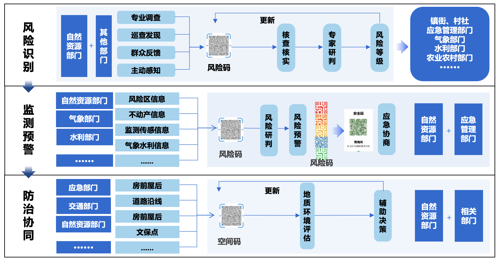

# Foo Index

[[toc]]

## Tables
| Tables | Are | Cool |
| ----   |:---:| ----:|
| col 3 is | right-aligned | $1600 |
| col 2 is | centered | $12 |
| col 1 is | are neat | $1 |


## Emoji
:tada: :100: :sob:

## Table of Contents

```
[[toc]]
```

## Custom Containers

### Default Title
```
::: info
This is an info box
:::

::: tip
This is a tip
:::

::: warning
This is a warning
:::

::: danger
This is a dangerous warning
:::

::: details
This is a details block
:::

```

::: info
This is an info box
:::

::: tip
This is a tip
:::

::: warning
This is a warning
:::

::: danger
This is a dangerous warning
:::

::: details
This is a details block
:::

### Custom Title

::: danger STOP
Danger zone, do not procees
:::

::: details Click me to view the Code
```js
console.log('Hello ViePress')
```
:::


## Syntax Highlighting in Code Blocks

```js
  export default {
    name: 'MyComponent',
    //...
  }
```

```html
  <ul>
    <li v-for="todo in todos">
      {{todo.text}}
    </li>
  </ul>
```

### Line Highlighting in Code Blocks

```js{4}
  export default {
    data() {
      return {
        msg: 'hhhhhhh'
      }
    }
  }
```

```js{1,4,6-8}
export default { // Highlighted
  data () {
    return {
      msg: `Highlighted!
      This line isn't highlighted,
      but this and the next 2 are.`,
      motd: 'VitePress is awesome',
      lorem: 'ipsum'
    }
  }
}
```

<<< @/snippets/snippet.js{2,4-7}

## Markdown File Inclusion

### Basic
<!--@include: ./basic.md-->

# Asset Handling
## Relating URLs


## Public Files


